# Load required library

First lets start with loading tidyverse library.


```r
library(tidyverse)
```


# Data Wrangling

convert column to appropriate type and read the file


```r
types <- 'idddddddii'
fram<- read_csv("framingham_200.csv", col_types = types)
```


select the columns that we need


```r
fram <- select(fram, TOTCHOL, AGE,
               DIABP,CIGPDAY,BMI,HEARTRTE,
               GLUCOSE,STROKE,CVD)
```


convert to tibble format


```r
fram <- as_tibble(fram)
```

## Check missing Values

now see whether there are missing value in the **fram** data set


```r
library(Amelia)
```

create missing map: in the map the yellow represents missing value


```r
missmap(fram, legend = T, col=c('yellow','black'), main = 'Missing value map')
```

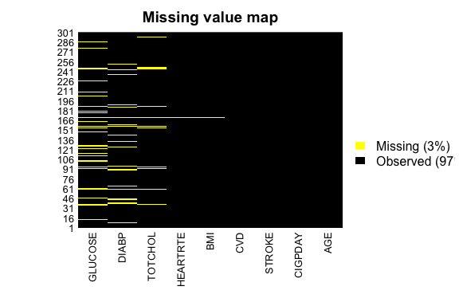

Now drop the missing value, following code will drop all the rows that contain missing value.


```r
fram <- fram %>% drop_na()
```

 now check the missing value again.
as you can see there are no more missing value in our data set


```r
missmap(fram, legend = T, col=c('yellow','black'), main = 'Missing value map')
```

```
## Warning in if (class(obj) == "amelia") {: the condition has length > 1 and
## only the first element will be used
```

```
## Warning: Unknown or uninitialised column: 'arguments'.

## Warning: Unknown or uninitialised column: 'arguments'.
```

```
## Warning: Unknown or uninitialised column: 'imputations'.
```

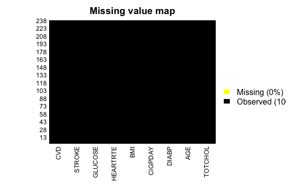

we don't need package **Amelia** anymore, so we will detach it


```r
detach('package:Amelia', unload = TRUE)
```


take a look to our data set


```r
glimpse(fram)
```

```
## Observations: 238
## Variables: 9
## $ TOTCHOL  <dbl> 234, 280, 280, 323, 335, 352, 219, 168, 223, 266, 250...
## $ AGE      <dbl> 43, 49, 36, 42, 60, 66, 53, 62, 68, 74, 59, 50, 62, 6...
## $ DIABP    <dbl> 68, 80, 96, 102, 83, 86, 109, 87, 88, 94, 80, 107, 83...
## $ CIGPDAY  <dbl> 20, 20, 20, 0, 0, 0, 0, 20, 0, 0, 0, 40, 0, 0, 0, 0, ...
## $ BMI      <dbl> 22.72, 22.72, 25.35, 25.85, 24.61, 25.56, 22.73, 20.5...
## $ HEARTRTE <dbl> 75, 96, 78, 80, 80, 85, 80, 65, 75, 150, 92, 60, 60, ...
## $ GLUCOSE  <dbl> 85, 90, 94, 84, 90, 90, 73, 80, 81, 85, 108, 87, 81, ...
## $ STROKE   <int> 0, 0, 0, 0, 0, 0, 1, 0, 0, 0, 0, 1, 0, 0, 0, 0, 0, 0,...
## $ CVD      <int> 0, 0, 0, 0, 0, 0, 1, 1, 1, 1, 0, 1, 1, 1, 1, 0, 0, 0,...
```

now convert stroke and cvd from integer to as factor


```r
fram$STROKE = as.factor(fram$STROKE)
fram$CVD = as.factor(fram$CVD)
```

take a look again to our data set


```r
glimpse(fram)
```

```
## Observations: 238
## Variables: 9
## $ TOTCHOL  <dbl> 234, 280, 280, 323, 335, 352, 219, 168, 223, 266, 250...
## $ AGE      <dbl> 43, 49, 36, 42, 60, 66, 53, 62, 68, 74, 59, 50, 62, 6...
## $ DIABP    <dbl> 68, 80, 96, 102, 83, 86, 109, 87, 88, 94, 80, 107, 83...
## $ CIGPDAY  <dbl> 20, 20, 20, 0, 0, 0, 0, 20, 0, 0, 0, 40, 0, 0, 0, 0, ...
## $ BMI      <dbl> 22.72, 22.72, 25.35, 25.85, 24.61, 25.56, 22.73, 20.5...
## $ HEARTRTE <dbl> 75, 96, 78, 80, 80, 85, 80, 65, 75, 150, 92, 60, 60, ...
## $ GLUCOSE  <dbl> 85, 90, 94, 84, 90, 90, 73, 80, 81, 85, 108, 87, 81, ...
## $ STROKE   <fct> 0, 0, 0, 0, 0, 0, 1, 0, 0, 0, 0, 1, 0, 0, 0, 0, 0, 0,...
## $ CVD      <fct> 0, 0, 0, 0, 0, 0, 1, 1, 1, 1, 0, 1, 1, 1, 1, 0, 0, 0,...
```

# Exploratory Data Analysis

## Plot

### QQPLOT

Now check the linearty plotting Q-Q plot 


```r
par(mfrow=c(3,3))
q1<- qqnorm(fram$TOTCHOL, main = 'Normal Q-Q Plot for TOTCHOL')
qqline(fram$TOTCHOL, col = "red")

q2<- qqnorm(fram$AGE, main = 'Normal Q-Q Plot for AGE')
qqline(fram$AGE, col = "red")

q3 <- qqnorm(fram$DIABP, main = 'Normal Q-Q Plot for DIABP')
qqline(fram$DIABP, col = "red")

q4<- qqnorm(fram$CIGPDAY, main = 'Normal Q-Q Plot for CIGPDAY')
qqline(fram$CIGPDAY, col = "red")

q5<- qqnorm(fram$BMI, main = 'Normal Q-Q Plot for BMI')
qqline(fram$BMI, col = "red")


q6<- qqnorm(fram$HEARTRTE, main = 'Normal Q-Q Plot for HEARTRTE')
qqline(fram$HEARTRTE, col = "red")

q7 <- qqnorm(fram$GLUCOSE, main = 'Normal Q-Q Plot for GLUCOSE')
qqline(fram$GLUCOSE, col = "red")
```

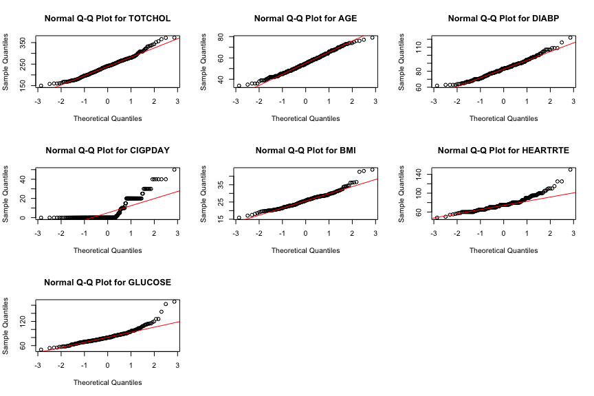


### QQPLOT in ggplot2


```r
ggplot(fram) +
  stat_qq(aes(sample = TOTCHOL))+
  xlab('Theoretical Quantiles')+ ylab('Sample Quantiles')+ 
  ggtitle('Q-Q plot for Serum Total Cholesterol')+
  theme(plot.title = element_text(hjust = 0.5))
```

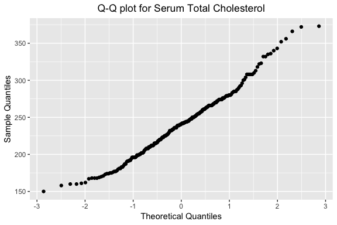

```r
ggplot(fram) +
  stat_qq(aes(sample = AGE))+
  xlab('Theoretical Quantiles')+ ylab('Sample Quantiles')+ 
  ggtitle('Q-Q plot for Age')+
  theme(plot.title = element_text(hjust = 0.5))
```

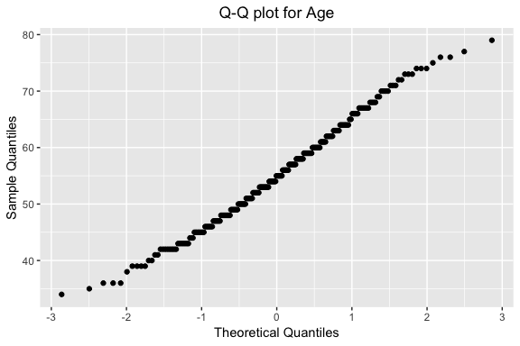

```r
ggplot(fram) +
  stat_qq(aes(sample = DIABP))+
  xlab('Theoretical Quantiles')+ ylab('Sample Quantiles')+ 
  ggtitle('Q-Q plot for DIABP')+
  theme(plot.title = element_text(hjust = 0.5))
```

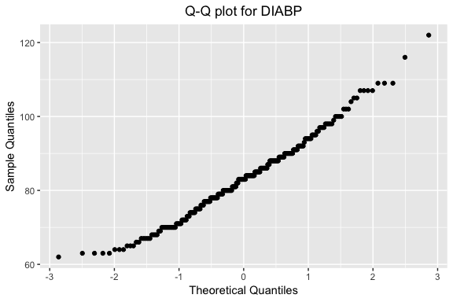

```r
ggplot(fram) +
  stat_qq(aes(sample = CIGPDAY))+
  xlab('Theoretical Quantiles')+ ylab('Sample Quantiles')+ 
  ggtitle('Q-Q plot for CIGPDAY')+
  theme(plot.title = element_text(hjust = 0.5))
```


```r
ggplot(fram) +
  stat_qq(aes(sample = BMI))+
  xlab('Theoretical Quantiles')+ ylab('Sample Quantiles')+ 
  ggtitle('Q-Q plot for BMI')+
  theme(plot.title = element_text(hjust = 0.5))
```

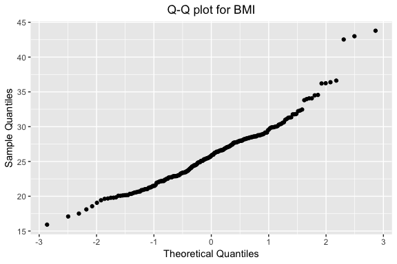

```r
ggplot(fram) +
  stat_qq(aes(sample = HEARTRTE))+
  xlab('Theoretical Quantiles')+ ylab('Sample Quantiles')+ 
  ggtitle('Q-Q plot for Heart Rate')+
  theme(plot.title = element_text(hjust = 0.5))
```

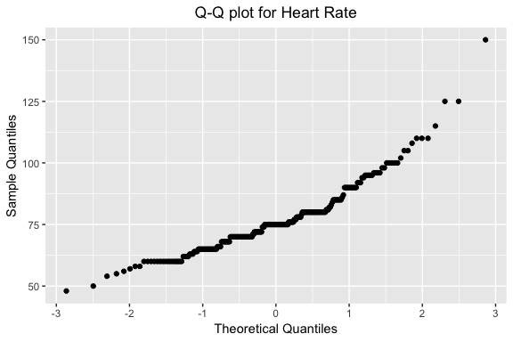

```r
ggplot(fram) +
  stat_qq(aes(sample = GLUCOSE))+
  xlab('Theoretical Quantiles')+ ylab('Sample Quantiles')+ 
  ggtitle('Q-Q plot for Glucose')+
  theme(plot.title = element_text(hjust = 0.5))
```

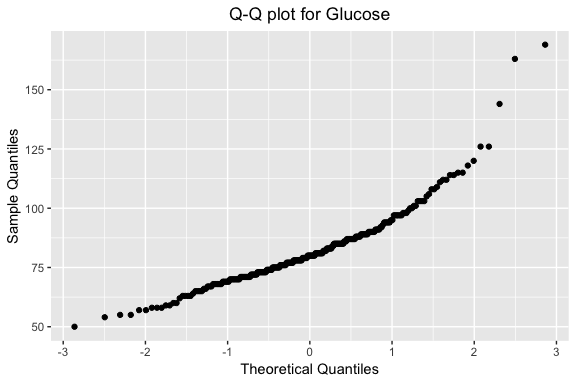

load RcolorBrewer package as we will need it 


```r
library(RColorBrewer)
```

### Boxplot

Now we will check outlier using boxplot

this one for only Total cholesterol

```r
boxplot( fram$TOTCHOL,  col = brewer.pal(1, "Pastel2" ), boxwex=.4, xlab= 'TOTCHOL')
```

```
## Warning in brewer.pal(1, "Pastel2"): minimal value for n is 3, returning requested palette with 3 different levels
```

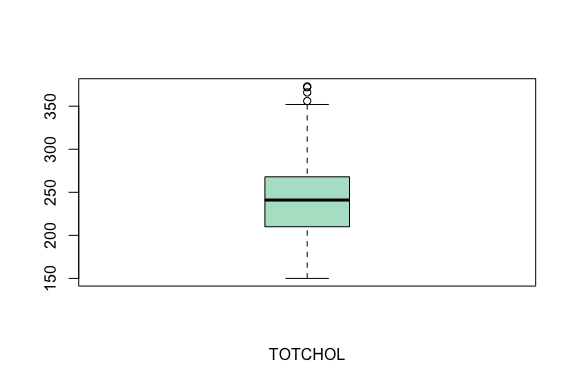

this one for other continuous variable


```r
boxplot( fram$AGE, fram$DIABP, 
         fram$CIGPDAY, fram$BMI,
         fram$HEARTRTE, fram$GLUCOSE,
         col = brewer.pal(6, "Pastel2" ), boxwex=.4,
         names =c('AGE','DIABP','CIGPDAY',
                  'BMI','HEARTRTE','GLUCOSE'))
```

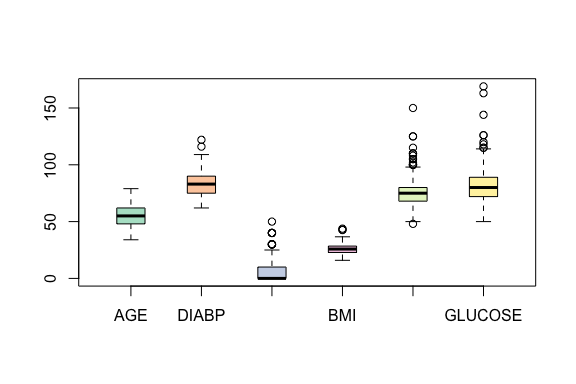

now remove the stroke and cvd column  from **fram** because those are categorical valueand and save in **fram_hist** for drawing histogram and finding *skewness* and *kurtosis* value. we will also do shapiro-wilk test.


```r
fram_hist <- select(fram, -STROKE, -CVD)
```

##  skewness and kurtosis value


```r
library(moments)
```


```r
lapply(fram_hist, skewness)
```

```
## $TOTCHOL
## [1] 0.4051152
## 
## $AGE
## [1] 0.1778808
## 
## $DIABP
## [1] 0.4201439
## 
## $CIGPDAY
## [1] 1.666346
## 
## $BMI
## [1] 0.8449174
## 
## $HEARTRTE
## [1] 1.372376
## 
## $GLUCOSE
## [1] 1.645548
```

```r
lapply(fram_hist, kurtosis)
```

```
## $TOTCHOL
## [1] 3.092682
## 
## $AGE
## [1] 2.465885
## 
## $DIABP
## [1] 3.142982
## 
## $CIGPDAY
## [1] 5.071831
## 
## $BMI
## [1] 4.913745
## 
## $HEARTRTE
## [1] 6.779659
## 
## $GLUCOSE
## [1] 8.547245
```

now do shapiro-wilk test

```r
lapply(fram_hist, shapiro.test)
```

```
## $TOTCHOL
## 
## 	Shapiro-Wilk normality test
## 
## data:  X[[i]]
## W = 0.9829, p-value = 0.005755
## 
## 
## $AGE
## 
## 	Shapiro-Wilk normality test
## 
## data:  X[[i]]
## W = 0.98998, p-value = 0.09904
## 
## 
## $DIABP
## 
## 	Shapiro-Wilk normality test
## 
## data:  X[[i]]
## W = 0.98328, p-value = 0.006685
## 
## 
## $CIGPDAY
## 
## 	Shapiro-Wilk normality test
## 
## data:  X[[i]]
## W = 0.65663, p-value < 2.2e-16
## 
## 
## $BMI
## 
## 	Shapiro-Wilk normality test
## 
## data:  X[[i]]
## W = 0.95784, p-value = 1.908e-06
## 
## 
## $HEARTRTE
## 
## 	Shapiro-Wilk normality test
## 
## data:  X[[i]]
## W = 0.91527, p-value = 2.173e-10
## 
## 
## $GLUCOSE
## 
## 	Shapiro-Wilk normality test
## 
## data:  X[[i]]
## W = 0.89713, p-value = 1.107e-11
```


```r
detach('package:moments', unload = TRUE)
```

lets put together all thing in one slide.
first load **psych** package


```r
library(psych)
```


```r
names<- c('TOTCHOL: SK-0.405: ', 'AGE: SK-0.177 ','DIABP: SK- 0.42',
          'CIGPDAY: SK-1.66','BMI: SK-0.84','HEARTRTE: SK-1.37','GLUCOSE: SK-1.64')


colnames(fram_hist)<-
  c('TOTCHOL \nSkewness-0.405 : Kurtosis:3.09: Shapiro-wilk test: 0.0058', 
    'AGE\nSkewness:0.177 : Kurtosis:2.46: p-value: 0.099',
    'DIABP\nSkewness:0.42: Kurtosis:3.14: p-value:0.00668' ,
    'CIGPDAY\nSkewness:1.66: Kurtosis:5.07: p-value: 2.2e-16' ,
    'BMI\nSkewness:0.84: Kurtosis:4.91: p-value:1.908e-06' ,
    'HEARTRTE\nSkewness:1.37: Kurtosis:6.77: p-value:2.173e-10 ',
    'GLUCOSE\nSkewness:1.64: Kurtosis:8.54: p-value:1.107e-11 ')


fh <- as.matrix(fram_hist) # convert to matrix
```


```r
multi.hist(fh, bcol = 'skyblue', dcol = "red") 
```

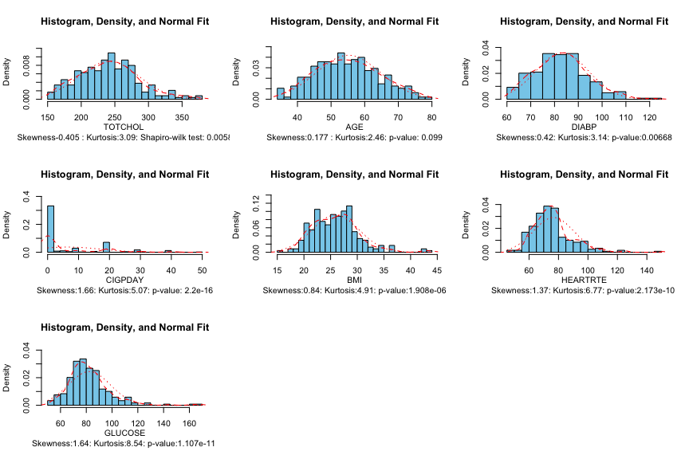


```r
detach('package:psych', unload = TRUE)
```

```
## Warning: 'psych' namespace cannot be unloaded:
##   namespace 'psych' is imported by 'broom' so cannot be unloaded
```

## Correlation Matrix

load few more package for correlation matrix


```r
library(viridis)
library(corrplot)
library(corrgram)
```


```r
fram_corr <- select(fram, -STROKE, -CVD)

cor.data <- cor(fram_corr)

corrplot(cor.data, method = "number", col = brewer.pal(8,'Dark2')) #first one
```

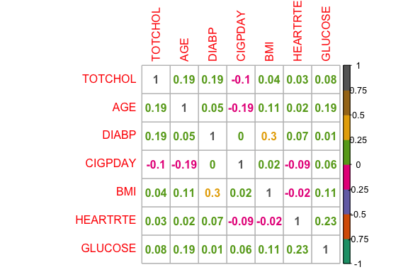

```r
corrplot(cor.data, method = "color") #second one 
```

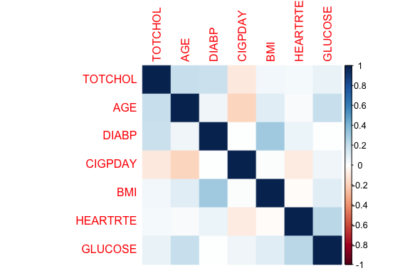

```r
corrgram(fram_corr, order = TRUE, 
         lower.panel = panel.shade, 
         upper.panel = panel.pie, 
         text.panel = panel.txt) #third one
```

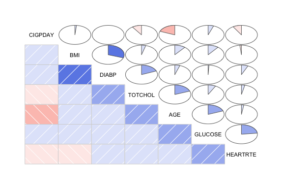


```r
detach('package:viridis', unload = TRUE)
```

```
## Warning: 'viridis' namespace cannot be unloaded:
##   namespace 'viridis' is imported by 'dendextend' so cannot be unloaded
```

```r
detach('package:corrplot', unload = TRUE)
detach('package:corrgram', unload = TRUE)
```

we can do correlation matrix few other way


```r
pairs(  ~  TOTCHOL+
        AGE +
        DIABP+
        BMI+
        HEARTRTE+
        GLUCOSE ,data = fram, main= 'Scatterplot Matrix')
```

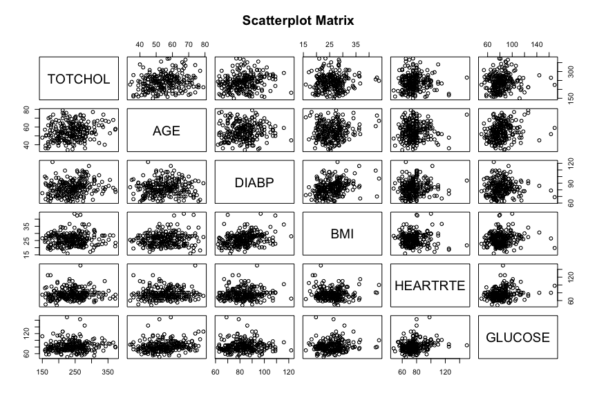


```r
library(GGally)

#fram_corr is data set without stroke and cvd column

ggpairs(fram_corr)
```

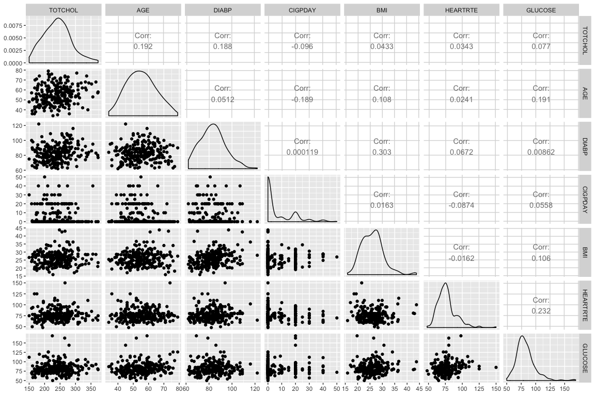


```r
detach('package:GGally', unload = TRUE)
```


 ### correlation test for each variable with p value
 

```r
library(Hmisc)
```
 

```r
rcorr(as.matrix(fram_corr))
```

```
##          TOTCHOL   AGE DIABP CIGPDAY   BMI HEARTRTE GLUCOSE
## TOTCHOL     1.00  0.19  0.19   -0.10  0.04     0.03    0.08
## AGE         0.19  1.00  0.05   -0.19  0.11     0.02    0.19
## DIABP       0.19  0.05  1.00    0.00  0.30     0.07    0.01
## CIGPDAY    -0.10 -0.19  0.00    1.00  0.02    -0.09    0.06
## BMI         0.04  0.11  0.30    0.02  1.00    -0.02    0.11
## HEARTRTE    0.03  0.02  0.07   -0.09 -0.02     1.00    0.23
## GLUCOSE     0.08  0.19  0.01    0.06  0.11     0.23    1.00
## 
## n= 238 
## 
## 
## P
##          TOTCHOL AGE    DIABP  CIGPDAY BMI    HEARTRTE GLUCOSE
## TOTCHOL          0.0029 0.0036 0.1396  0.5066 0.5980   0.2369 
## AGE      0.0029         0.4321 0.0035  0.0975 0.7109   0.0031 
## DIABP    0.0036  0.4321        0.9985  0.0000 0.3018   0.8947 
## CIGPDAY  0.1396  0.0035 0.9985         0.8023 0.1789   0.3912 
## BMI      0.5066  0.0975 0.0000 0.8023         0.8032   0.1023 
## HEARTRTE 0.5980  0.7109 0.3018 0.1789  0.8032          0.0003 
## GLUCOSE  0.2369  0.0031 0.8947 0.3912  0.1023 0.0003
```


```r
detach('package:Hmisc', unload = TRUE)
```

# Modeling

 multiple linear regression with all independent variable


```r
model_all <- lm(TOTCHOL ~ 
                  AGE +
                  DIABP+
                  CIGPDAY+
                  BMI+
                  HEARTRTE+
                  GLUCOSE+
                  STROKE+
                  CVD,  data = fram) # you can also use `lm(TOTCHOL~ . , data=fram)`
```


```r
summary(model_all)
```

```
## 
## Call:
## lm(formula = TOTCHOL ~ AGE + DIABP + CIGPDAY + BMI + HEARTRTE + 
##     GLUCOSE + STROKE + CVD, data = fram)
## 
## Residuals:
##     Min      1Q  Median      3Q     Max 
## -95.584 -29.781   0.335  25.328 131.083 
## 
## Coefficients:
##               Estimate Std. Error t value Pr(>|t|)    
## (Intercept)  1.250e+02  3.390e+01   3.686 0.000285 ***
## AGE          8.573e-01  3.259e-01   2.630 0.009114 ** 
## DIABP        8.258e-01  2.732e-01   3.023 0.002787 ** 
## CIGPDAY     -2.457e-01  2.753e-01  -0.893 0.372986    
## BMI         -3.350e-01  6.897e-01  -0.486 0.627644    
## HEARTRTE    -6.647e-04  2.148e-01  -0.003 0.997534    
## GLUCOSE      1.461e-01  1.845e-01   0.792 0.429321    
## STROKE1     -1.123e+01  1.278e+01  -0.879 0.380454    
## CVD1        -3.251e+00  8.038e+00  -0.405 0.686220    
## ---
## Signif. codes:  0 '***' 0.001 '**' 0.01 '*' 0.05 '.' 0.1 ' ' 1
## 
## Residual standard error: 43.57 on 229 degrees of freedom
## Multiple R-squared:  0.08245,	Adjusted R-squared:  0.0504 
## F-statistic: 2.572 on 8 and 229 DF,  p-value: 0.01049
```

```r
anova(model_all)
```

<div class="kable-table">

              Df         Sum Sq       Mean Sq     F value      Pr(>F)
----------  ----  -------------  ------------  ----------  ----------
AGE            1    17475.48509   17475.48509   9.2063406   0.0026902
DIABP          1    15040.22396   15040.22396   7.9234095   0.0053048
CIGPDAY        1     1859.87234    1859.87234   0.9798079   0.3232910
BMI            1      424.35003     424.35003   0.2235538   0.6367957
HEARTRTE       1       63.37958      63.37958   0.0333893   0.8551736
GLUCOSE        1     1136.74662    1136.74662   0.5988547   0.4398135
STROKE         1     2750.47741    2750.47741   1.4489916   0.2299326
CVD            1      310.58981     310.58981   0.1636232   0.6862199
Residuals    229   434688.03482    1898.20103          NA          NA

</div>

## Diagnostics

for diagnostic plot

```r
plot(model_all)
```

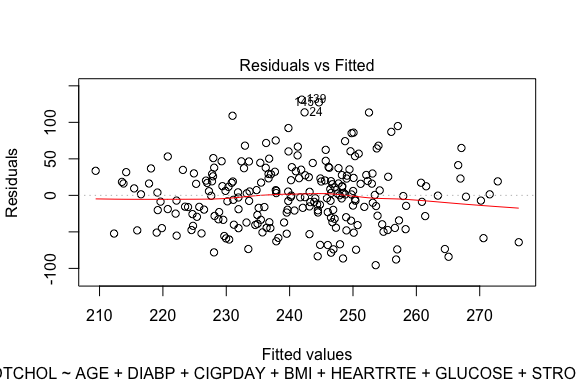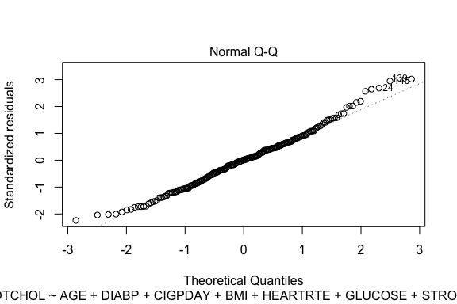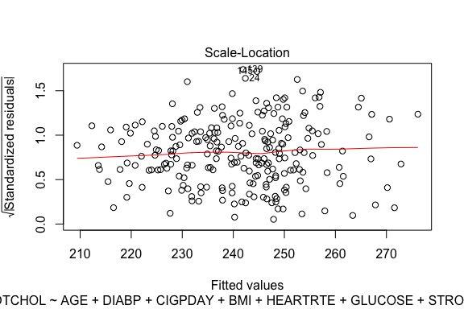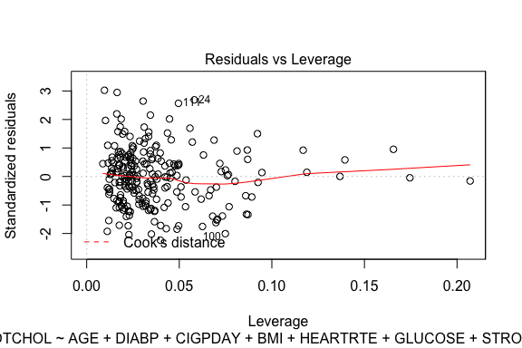


few other command that might be useful <br>

* coefficients(model_all) # model coefficients  
* confint(model_all, level=0.95) # CIs for model parameters   
* fitted(model_all) # predicted values 
* residuals(model_all) # residuals  
* anova(model_all) # anova table   
* vcov(model_all) # covariance matrix for model parameters  
* influence(model_all) # regression diagnostics 


since only age and diabp are significant, lets do model with only those two independent variable


```r
model_age_diabp<- lm(TOTCHOL~
                       AGE+
                       DIABP, data = fram)
summary(model_age_diabp)
```

```
## 
## Call:
## lm(formula = TOTCHOL ~ AGE + DIABP, data = fram)
## 
## Residuals:
##    Min     1Q Median     3Q    Max 
## -96.77 -31.08   0.92  26.06 133.93 
## 
## Coefficients:
##             Estimate Std. Error t value Pr(>|t|)    
## (Intercept) 133.8321    26.2119   5.106  6.8e-07 ***
## AGE           0.8588     0.2959   2.902  0.00406 ** 
## DIABP         0.7198     0.2543   2.830  0.00505 ** 
## ---
## Signif. codes:  0 '***' 0.001 '**' 0.01 '*' 0.05 '.' 0.1 ' ' 1
## 
## Residual standard error: 43.33 on 235 degrees of freedom
## Multiple R-squared:  0.06863,	Adjusted R-squared:  0.06071 
## F-statistic: 8.659 on 2 and 235 DF,  p-value: 0.0002353
```

```r
anova(model_age_diabp)
```

<div class="kable-table">

              Df      Sum Sq     Mean Sq    F value      Pr(>F)
----------  ----  ----------  ----------  ---------  ----------
AGE            1    17475.49   17475.485   9.307406   0.0025443
DIABP          1    15040.22   15040.224   8.010391   0.0050535
Residuals    235   441233.45    1877.589         NA          NA

</div>

for diagnostic plot 


```r
plot(model_age_diabp)
```

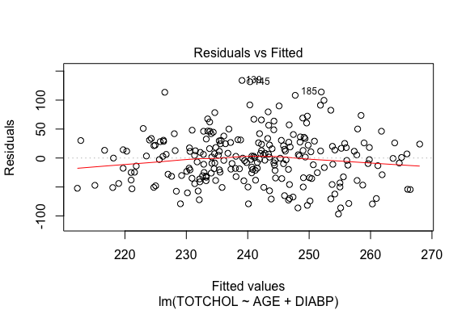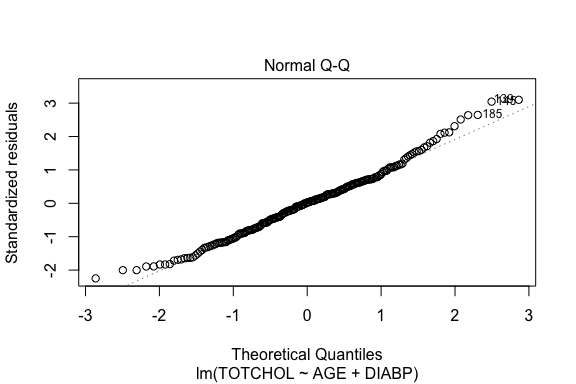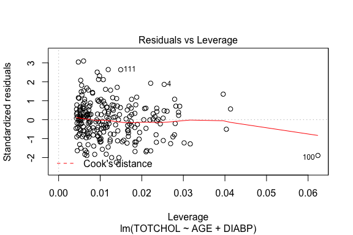

## Log Transformation

log transformation of variable and save in column


```r
fram <- fram %>% as_tibble() %>% 
  mutate(TOTCHOL_log = log10(TOTCHOL),
         DIABP_log = log10(DIABP),
         
         CIGPDAY_log = log10(CIGPDAY+1),
         BMI_log = log10(BMI),
         
         HEARTRTE_log= log10(HEARTRTE),
         GLUCOSE_log = log10(GLUCOSE))
```

Q-Q plot again


```r
par(mfrow=c(2,3))
q1<- qqnorm(fram$TOTCHOL_log, 
            main="QQ-plot for total cholesterol")
qqline(fram$TOTCHOL_log, col = "red")


q2<- qqnorm(fram$BMI_log, main= 'QQ-plot for BMI')
qqline(fram$BMI_log, col = "red")

q3<- qqnorm(fram$DIABP_log, main = 'QQ-plot for DIABP')
qqline(fram$DIABP_log, col = "red")

q4<- qqnorm(fram$HEARTRTE_log, main = 'QQ-plot for HEART RATE')
qqline(fram$HEARTRTE_log, col = "red")

q5<- qqnorm(fram$GLUCOSE_log, main = 'QQ-plot for Glucose')
qqline(fram$GLUCOSE_log, col = "red")

q6<- qqnorm(fram$CIGPDAY_log, main = 'QQ-plot for CIGPDAY')
qqline(fram$CIGPDAY_log, col = "red")
```

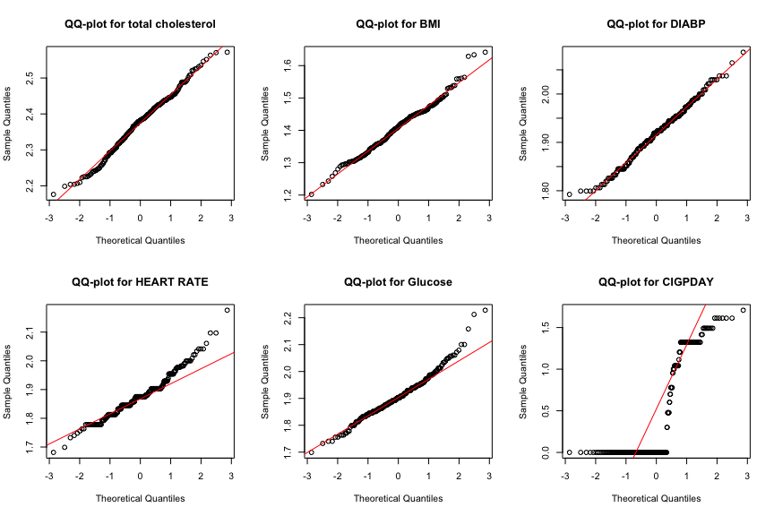

### model with log transformed data
multiple linear regression with all independent variable


```r
model_all_log <- lm(TOTCHOL ~ 
                  AGE +
                  DIABP_log+
                  CIGPDAY+
                  BMI_log+
                  HEARTRTE_log+
                  GLUCOSE_log+
                  STROKE+
                  CVD,  data = fram)

summary(model_all_log)
```

```
## 
## Call:
## lm(formula = TOTCHOL ~ AGE + DIABP_log + CIGPDAY + BMI_log + 
##     HEARTRTE_log + GLUCOSE_log + STROKE + CVD, data = fram)
## 
## Residuals:
##     Min      1Q  Median      3Q     Max 
## -96.011 -29.687   0.799  25.780 130.778 
## 
## Coefficients:
##               Estimate Std. Error t value Pr(>|t|)   
## (Intercept)  -151.8425   130.7284  -1.162  0.24664   
## AGE             0.8486     0.3264   2.600  0.00993 **
## DIABP_log     161.9058    52.7782   3.068  0.00242 **
## CIGPDAY        -0.2332     0.2746  -0.849  0.39670   
## BMI_log       -21.6235    42.3010  -0.511  0.60972   
## HEARTRTE_log    7.8446    40.5054   0.194  0.84661   
## GLUCOSE_log    28.6186    37.9735   0.754  0.45183   
## STROKE1       -10.9835    12.7614  -0.861  0.39031   
## CVD1           -3.2077     8.0271  -0.400  0.68982   
## ---
## Signif. codes:  0 '***' 0.001 '**' 0.01 '*' 0.05 '.' 0.1 ' ' 1
## 
## Residual standard error: 43.51 on 229 degrees of freedom
## Multiple R-squared:  0.08473,	Adjusted R-squared:  0.05275 
## F-statistic:  2.65 on 8 and 229 DF,  p-value: 0.008485
```

```r
anova(model_all_log)
```

<div class="kable-table">

                 Df        Sum Sq      Mean Sq     F value      Pr(>F)
-------------  ----  ------------  -----------  ----------  ----------
AGE               1    17475.4851   17475.4851   9.2292376   0.0026581
DIABP_log         1    16077.9219   16077.9219   8.4911498   0.0039224
CIGPDAY           1     1807.5185    1807.5185   0.9545954   0.3295833
BMI_log           1      421.7908     421.7908   0.2227582   0.6373957
HEARTRTE_log      1      287.5748     287.5748   0.1518754   0.6971118
GLUCOSE_log       1     1107.6072    1107.6072   0.5849549   0.4451641
STROKE            1     2659.2978    2659.2978   1.4044412   0.2372098
CVD               1      302.3577     302.3577   0.1596826   0.6898214
Residuals       229   433609.6059    1893.4917          NA          NA

</div>


```r
model_age_diabp_log <- lm(TOTCHOL ~ 
                            AGE +
                            DIABP_log, 
                          data = fram)

summary(model_age_diabp_log)
```

```
## 
## Call:
## lm(formula = TOTCHOL ~ AGE + DIABP_log, data = fram)
## 
## Residuals:
##     Min      1Q  Median      3Q     Max 
## -96.688 -31.277   0.811  26.492 133.769 
## 
## Coefficients:
##             Estimate Std. Error t value Pr(>|t|)   
## (Intercept) -81.4884    94.5952  -0.861  0.38987   
## AGE           0.8553     0.2956   2.893  0.00417 **
## DIABP_log   143.7133    49.0536   2.930  0.00373 **
## ---
## Signif. codes:  0 '***' 0.001 '**' 0.01 '*' 0.05 '.' 0.1 ' ' 1
## 
## Residual standard error: 43.28 on 235 degrees of freedom
## Multiple R-squared:  0.07083,	Adjusted R-squared:  0.06292 
## F-statistic: 8.956 on 2 and 235 DF,  p-value: 0.0001784
```

```r
anova(model_age_diabp_log)
```

<div class="kable-table">

              Df      Sum Sq     Mean Sq    F value      Pr(>F)
----------  ----  ----------  ----------  ---------  ----------
AGE            1    17475.49   17475.485   9.329347   0.0025151
DIABP_log      1    16077.92   16077.922   8.583253   0.0037268
Residuals    235   440195.75    1873.173         NA          NA

</div>

### multicolinearity


```r
library(car)
```

variance inflation factor(VIF)

It quantifies the severity of multicollinearity in an ordinary least squares regression analysis.
value less than 5 is acceptable and it (<5) means no significant multicolinearity between independent variables.


```r
vif(model_all)
```

```
##      AGE    DIABP  CIGPDAY      BMI HEARTRTE  GLUCOSE   STROKE      CVD 
## 1.203156 1.143926 1.074423 1.130897 1.081534 1.129498 1.357360 1.475457
```

```r
vif(model_all_log)
```

```
##          AGE    DIABP_log      CIGPDAY      BMI_log HEARTRTE_log 
##     1.209327     1.148490     1.072183     1.134277     1.086837 
##  GLUCOSE_log       STROKE          CVD 
##     1.137439     1.357674     1.475136
```

```r
vif(model_age_diabp)
```

```
##      AGE    DIABP 
## 1.002625 1.002625
```

```r
vif(model_age_diabp_log)
```

```
##       AGE DIABP_log 
##  1.002873  1.002873
```


```r
detach('package:car', unload = TRUE)
```


## model selection by AIC 


```r
library(MASS)
```


```r
stepAIC(model_all_log, direction = 'backward')
```

```
## Start:  AIC=1804.82
## TOTCHOL ~ AGE + DIABP_log + CIGPDAY + BMI_log + HEARTRTE_log + 
##     GLUCOSE_log + STROKE + CVD
## 
##                Df Sum of Sq    RSS    AIC
## - HEARTRTE_log  1      71.0 433681 1802.8
## - CVD           1     302.4 433912 1803.0
## - BMI_log       1     494.8 434104 1803.1
## - GLUCOSE_log   1    1075.5 434685 1803.4
## - CIGPDAY       1    1365.2 434975 1803.6
## - STROKE        1    1402.7 435012 1803.6
## <none>                      433610 1804.8
## - AGE           1   12800.3 446410 1809.7
## - DIABP_log     1   17818.9 451428 1812.4
## 
## Step:  AIC=1802.85
## TOTCHOL ~ AGE + DIABP_log + CIGPDAY + BMI_log + GLUCOSE_log + 
##     STROKE + CVD
## 
##               Df Sum of Sq    RSS    AIC
## - CVD          1     316.0 433997 1801.0
## - BMI_log      1     530.7 434211 1801.2
## - GLUCOSE_log  1    1302.7 434983 1801.6
## - STROKE       1    1379.9 435061 1801.6
## - CIGPDAY      1    1441.3 435122 1801.6
## <none>                     433681 1802.8
## - AGE          1   12760.0 446441 1807.8
## - DIABP_log    1   18184.3 451865 1810.6
## 
## Step:  AIC=1801.03
## TOTCHOL ~ AGE + DIABP_log + CIGPDAY + BMI_log + GLUCOSE_log + 
##     STROKE
## 
##               Df Sum of Sq    RSS    AIC
## - BMI_log      1     586.3 434583 1799.3
## - GLUCOSE_log  1    1242.7 435239 1799.7
## - CIGPDAY      1    1441.2 435438 1799.8
## - STROKE       1    2640.1 436637 1800.5
## <none>                     433997 1801.0
## - AGE          1   12616.6 446613 1805.8
## - DIABP_log    1   17944.5 451941 1808.7
## 
## Step:  AIC=1799.35
## TOTCHOL ~ AGE + DIABP_log + CIGPDAY + GLUCOSE_log + STROKE
## 
##               Df Sum of Sq    RSS    AIC
## - GLUCOSE_log  1    1105.1 435688 1798.0
## - CIGPDAY      1    1526.3 436109 1798.2
## - STROKE       1    2615.0 437198 1798.8
## <none>                     434583 1799.3
## - AGE          1   12344.0 446927 1804.0
## - DIABP_log    1   17648.4 452231 1806.8
## 
## Step:  AIC=1797.95
## TOTCHOL ~ AGE + DIABP_log + CIGPDAY + STROKE
## 
##             Df Sum of Sq    RSS    AIC
## - CIGPDAY    1    1311.5 436999 1796.7
## - STROKE     1    2700.2 438388 1797.4
## <none>                   435688 1798.0
## - AGE        1   14728.3 450416 1803.9
## - DIABP_log  1   17877.0 453565 1805.5
## 
## Step:  AIC=1796.67
## TOTCHOL ~ AGE + DIABP_log + STROKE
## 
##             Df Sum of Sq    RSS    AIC
## - STROKE     1    3196.3 440196 1796.4
## <none>                   436999 1796.7
## - AGE        1   17272.0 454272 1803.9
## - DIABP_log  1   18015.0 455014 1804.3
## 
## Step:  AIC=1796.4
## TOTCHOL ~ AGE + DIABP_log
## 
##             Df Sum of Sq    RSS    AIC
## <none>                   440196 1796.4
## - AGE        1     15680 455875 1802.7
## - DIABP_log  1     16078 456274 1802.9
```

```
## 
## Call:
## lm(formula = TOTCHOL ~ AGE + DIABP_log, data = fram)
## 
## Coefficients:
## (Intercept)          AGE    DIABP_log  
##    -81.4884       0.8553     143.7133
```


```r
detach('package:MASS', unload = TRUE)
```

# final model

$$\hat{y}= -81.4884 + 0.8553 * AGE + 143.7133* log_{10}(DIABP)$$


### The End
